# SPRINT 1 

## Entendimento de Negócios

### 1 - Analise do parceiro de projeto e Business Drivers

O Bank of America (BofA), uma das instituições financeiras
mais proeminentes do cenário global. Com mais de
205.000 colaboradores, sua presença é marcante em mais de 30 países, incluindo Estados Unidos,
Canadá, Reino Unido, México, Brasil, China, Japão, Índia e Austrália. Ao longo de décadas, o BofA
solidificou sua posição como um gigante global, proporcionando uma ampla gama de produtos e serviços
financeiros para indivíduos, empresas e governos.

Atualmente, o Bank of America destaca-se como uma das quatro maiores instituições financeiras nos
Estados Unidos, gerenciando ativos que ultrapassam os US$ 2,4 trilhões. Seu faturamento anual se
aproxima dos US$ 100 bilhões com um lucro estimado em cerca de US$ 26 bilhões. No que diz respeito
aos produtos e serviços, o banco oferece desde serviços bancários de varejo até operações nos
mercados de capitais, passando por serviços internacionais e gestão de fortunas.

#### 1.1 - Setor de aplicação

Setor de aplicação - Indicaro(s) setor(es) industrial(is) atendidos/suportados pelo
sistema;

O sistema ISS (Investment State System) desenvolvido para uso interno o Bank of America tem uma variedade de usos dentro do setor financeiro. Ele facilita a gestão de contas dos clientes, realização de transações financeiras, análise de risco, detecção de fraudes, atendimento ao cliente e gestão de investimentos. Essas funcionalidades ajudam o banco a oferecer serviços eficientes e seguros aos seus clientes, adaptados às demandas do mercado financeiro.

#### 1.2 - Adição de Valor

A plataforma digital valoriza o negócio ao oferecer uma infraestrutura sólida e eficiente para a gestão eletrônica de conteúdo de documentos, tais como PDFs, documentos do Word ou apresentações do PowerPoint, por meio de um ECM (Enterprise Content Management, ou, Sistema de Gestão de Conteúdo Empresarial) que trata-se de um conjunto de estratégias, processos e ferramentas utilizadas para capturar, gerenciar, armazenar, preservar e distribuir conteúdo e documentos relacionados às atividades de uma organização de forma eficiente e organizada. . Esse processo assegura a segurança e a disponibilidade necessárias para realizar operações financeiras com tranquilidade.

### 1.3 - Mapeamento de Riscos e Oportunidade 

 Riscos e oportunidades - apresente a matriz de risco - Além das vulnerabilidades

identificadas no item, outros riscos podem ser identificados pelo fluxo de negócios
envolvendo os níveis de entrega tais como (contrato SLA [Service Leve lA greement]: disponibilidade, segurança, desempenho, rastreabilidade, tolerância a falhas, entre
outros);

https://docs.google.com/spreadsheets/d/1VgyiANiPW0c5CsmuxcaUaIbm80WJT1YyVxC8MWhN-Ik/edit#gid=0

-Tecnologia Avançada: Investir em novas tecnologias pode melhorar a eficiência e a segurança.

-Capacitação Contínua: Treinamento regular dos funcionários em novos protocolos e tecnologias.

-Parcerias Estratégicas: Colaborar com empresas de tecnologia e segurança para aprimorar capacidades.

-Feedback Constante: Utilizar feedback de clientes para ajustar e melhorar os SLAs.

Ao mapear esses riscos e oportunidades, uma organização pode não só se preparar melhor para os desafios existentes e emergentes, mas também aproveitar para se diferenciar positivamente no mercado. A chave está em uma avaliação contínua e na adaptação às novas circunstâncias e tecnologias.

### 2 - Melhoria do SLA 

A complexidade e as exigências do sistema de orquestração de documentos do Bank of America, que facilita o acesso seguro e gerenciado a documentos para diversas empresas, destacam a importância de melhorias significativas nos SLAs (Service Level Agreements), particularmente em segurança, disponibilidade, desempenho e tolerância a falhas. A ausência de criptografia atualmente e o acesso exclusivo de cada empresa a seus documentos ressaltam a necessidade de fortalecer esses aspectos críticos do sistema.

A implementação de criptografia robusta de dados at-rest e in-transit é essencial para proteger documentos contra acessos não autorizados, reforçando a confidencialidade e a integridade dos dados. Além disso, a introdução de estratégias de redundância e failover garantirá a continuidade operacional do sistema, mesmo em caso de falhas, maximizando assim o tempo de atividade através de múltiplos data centers, replicação de dados e balanceamento de carga. O desempenho do sistema pode ser otimizado para reduzir o tempo de resposta, através da melhoria da infraestrutura de hardware, revisão de código para eficiência e implementação de caching. Estas medidas, juntamente com políticas de backup e recuperação de desastres, aumentam a tolerância a falhas do sistema para 99,9%, reduzindo significativamente o risco de incidentes concentrados.

A rastreabilidade é um componente vital para monitorar a eficácia dessas melhorias. A implementação de um sistema abrangente de logs que registre todas as ações realizadas no sistema, incluindo acessos, modificações de documentos e tentativas de login, facilitará a investigação de incidentes e o monitoramento de atividades suspeitas. O controle de versão dos documentos garante uma rastreabilidade ao longo do tempo que é fundamental para auditorias e conformidade regulatória. O monitoramento em tempo real do desempenho do sistema e da atividade dos usuários ajuda a detectar e responder rapidamente a falhas operacionais ou tentativas de violação de segurança.

Integrando cadeias de aprovação e assinaturas digitais, podemos assegurar que todas as ações sejam autorizadas e registradas adequadamente, adicionando uma camada extra de segurança e rastreabilidade. Desenvolver painéis de controle e relatórios que consolidam dados de rastreabilidade de várias fontes dentro do sistema permite que gestores e equipes de TI tenham uma visão clara do funcionamento e da segurança do sistema, facilitando a gestão eficaz e a resposta rápida a qualquer questão que possa surgir.

Ao implementar essas melhorias, o sistema não apenas atenderá melhor aos requisitos dos usuários, mas também estará alinhado com as melhores práticas de segurança e gestão de TI, reforçando sua posição como uma solução confiável e essencial para o gerenciamento de documentos bancários. As métricas de desempenho, segurança, disponibilidade e falhas são constantemente avaliadas para assegurar que o sistema atenda ou exceda os SLAs estabelecidos, proporcionando assim um serviço de alta qualidade e confiável.

### 3 - Processo de negócio e fluxos críticos

Nos processos empresariais contemporâneos, a gestão eficiente de documentos desempenha um papel fundamental na operação e no sucesso das organizações. Neste contexto, é essencial compreender os fluxos de trabalho que envolvem desde a captura e armazenamento até a recuperação e distribuição de documentos. Além disso, é crucial estar ciente dos pontos críticos que podem afetar a segurança e a disponibilidade desses serviços. A seguir, serão detalhados esses processos, destacando suas etapas e requisitos essenciais, bem como os pontos críticos que merecem atenção especial para garantir a eficácia e integridade desses sistemas.

O fluxo de negócio compreende uma série de etapas essenciais que vão desde a captura inicial até a distribuição posterior dos documentos. Inicialmente, ocorre a captura dos documentos, onde eles são coletados, seja em formato físico ou digital, e então são inseridos no sistema de gestão da empresa. Em seguida, esses documentos são armazenados de forma binária, preservando sua estrutura original, dentro do banco de dados da empresa.

**Tabela 1: Processo de Negócio**

| Passo                                      | Descrição                                                                                                                                                                                                                     |
|--------------------------------------------|-------------------------------------------------------------------------------------------------------------------------------------------------------------------------------------------------------------------------------|
| Consulta ao documento                      | IA busca do documento ao ECM (Sistema de Gestão de Conteúdo Empresarial), sendo renderzida na interface.                                                                                                       |
| Armazenamento em formato binário          | Os documentos são armazenados de forma binária, ou seja, em sua forma original, no banco de dados da empresa, garantindo integridade e preservação do conteúdo.                                                            |
| Renderização do banco de dados            | O sistema processa os documentos armazenados no banco de dados, tornando-os acessíveis para visualização e manipulação conforme necessário, mantendo sua estrutura e formatos originais, como PDF, Word ou PowerPoint. |

Existem pontos críticos que demandam atenção especial no processo, visando garantir a segurança e disponibilidade dos serviços oferecidos. Um desses pontos é a segurança na autenticação dos usuários, ou seja, o sistema precisa assegurar que apenas usuários autorizados tenham acesso aos documentos e funcionalidades, evitando assim acessos não autorizados e protegendo informações sensíveis. Além disso, é fundamental que o sistema registre logs detalhados das atividades dos usuários, proporcionando uma trilha de auditoria que permita monitorar o acesso e identificar qualquer atividade suspeita ou não autorizada. Outro ponto crítico é garantir a disponibilidade dos serviços, especialmente no que diz respeito à consulta 

**Tabela 2: Pontos critícos para melhorias**

| Passo                                    | Descrição                                                                                                                                                         |
|------------------------------------------|-------------------------------------------------------------------------------------------------------------------------------------------------------------------|
| Segurança na autenticação dos usuários  | Garante que apenas usuários autorizados tenham acesso aos documentos e funcionalidades do sistema, evitando acesso não autorizado e protegendo informações sensíveis. |
| Registro de logs                        | Registra atividades dos usuários no sistema, fornecendo uma trilha de auditoria que pode ser usada para monitorar o acesso e identificar atividades suspeitas ou não autorizadas. |
| Disponibilidade dos serviços            | Certifica-se de que os serviços relacionados à consulta e edição de documentos estejam sempre disponíveis para os usuários, garantindo que possam realizar suas tarefas sem interrupções indesejadas. |

### 4 - Volumentria 

A análise das volumetrias associadas ao sistema atual do Bank of America:

1. **Arquivos**:
   - Média diária de arquivos PDF recebidos: 20
   - Acessado em média 6.000 vezes por dia
   - Acessado 180.000 vezes por mês
   - Acessado 2.160.000 vezes por ano
   - Taxa de erro na visualização dos arquivos: 5%
   - Objetivo de redução da taxa de erro: 2% ou menos

2. **Autenticação**:
   - Equipe de mais de 213.000 funcionários
   - Aproximadamente 30% dos funcionários necessitam de autenticação para acessar serviços
   - Taxa de erro durante a autenticação: em média, 7% dos funcionários
   - Objetivo de redução da taxa de erro durante a autenticação: média de até 2%

3. **Segurança de Rede**:
   - Processamento diário de 70 terabytes de dados sensíveis
   - Acesso à rede por mais de 213.000 funcionários, com aproximadamente 30% requerendo autenticação
   - Monitoramento do tráfego de rede para detectar tentativas de acessos não autorizados, que podem ocorrer em média 500 vezes por mês
   - Taxa de detecção de tentativas de acesso não autorizado: 85%
   - Objetivo de aumento da taxa de detecção para 95% para reforçar a segurança da rede

Objetivos de Melhoria:
- Redução da taxa de erro na visualização de arquivos PDF para 2% ou menos.
- Redução da taxa de erro durante a autenticação para uma média de até 2%.
- Aumento na taxa de detecção de acesso não autorizado a rede em 95% ou mais.

### 5 - Estratégia de crescimento estabelecida 

Para atender às necessidades da estratégia de crescimento estabelecida, é necessário implementar medidas específicas para reduzir os incidentes relacionados ao sistema do Bank of Americas:

**Objetivo:** Diminuir pela metade o número de incidentes mensais no sistema do Bank of Americas.

**Situação Atual com base em suposição:**
- Demanda de acessos por mês: 5.000
- Defeitos por mês: 500
- Falhas de acesso ao sistema por mês: 550
- Horas perdidas mensalmente: 100

**Estratégia Proposta:**
- Implementação de requisitos de tolerância a falhas e segurança do sistema.

**Medidas Específicas:**
   - Investir em melhorias na infraestrutura de TI para garantir maior estabilidade e confiabilidade do sistema.
   - Atualizar hardware e software conforme necessário para suportar as demandas atuais e futuras.

2. **Tolerância a Falhas:**
   - Desenvolver e implementar sistemas e procedimentos que minimizem o impacto de falhas de hardware, software ou rede.
   - Configurar redundâncias para garantir a disponibilidade contínua do sistema.

3. **Segurança do Sistema:**
   - Reforçar medidas de segurança cibernética para proteger o sistema contra ameaças internas e externas.
   - Implementar autenticação multifatorial, criptografia robusta e monitoramento proativo de atividades suspeitas.

4. **Treinamento e Conscientização dos Usuários:**
   - Realizar treinamentos regulares para os usuários sobre boas práticas de segurança da informação.

**Indicadores de Sucesso:**
- Redução da demanda de acessos mensais para 2.500 ou menos.
- Redução do número de defeitos mensais para 250 ou menos.
- Redução das falhas de acesso ao sistema mensais para 275 ou menos.
- Redução do tempo perdido mensalmente para 50 horas ou menos.

**Avaliação e Ajustes:**
- Monitorar regularmente através de logs o desempenho para avaliar o progresso em direção aos objetivos.
- Realizar ajustes na estratégia conforme necessário com base nos resultados e nas mudanças nas condições do ambiente de negócios.
  
**Descrição sucinta dos requisitos não funcionais documentados na seção 1.1**

1. **Criptografia inadequada**: A ausência de criptografia robusta de dados armazenados e em trânsito deixa os documentos vulneráveis a acessos não autorizados, comprometendo a confidencialidade e integridade dos dados.

2. **Resiliência inadequada**: Falta de estratégias de redundância, tendo somente um servidor, torna o sistema suscetível a interrupções operacionais em caso de falhas, afetando a disponibilidade e a continuidade do serviço.

3. **Desempenho insuficiente**: O sistema atual carece de otimização de desempenho, resultando em tempos de resposta lentos que impactam negativamente a experiência do usuário e a eficiência operacional.

4. **Rastreabilidade limitada**: A falta de um sistema abrangente de logs e controle de versão dificulta a rastreabilidade das ações realizadas no sistema, comprometendo a capacidade de investigação de incidentes e monitoramento de atividades suspeitas.

5. **Falta de monitoramento em tempo real**: A ausência de monitoramento em tempo real do desempenho do sistema e da atividade dos usuários dificulta a detecção e resposta rápida a falhas operacionais ou tentativas de violação de segurança.

### 6 Arquitetura do Sistema Novo (Versão 1.5)

**Figura 1**: Proposta de Arquitetura 

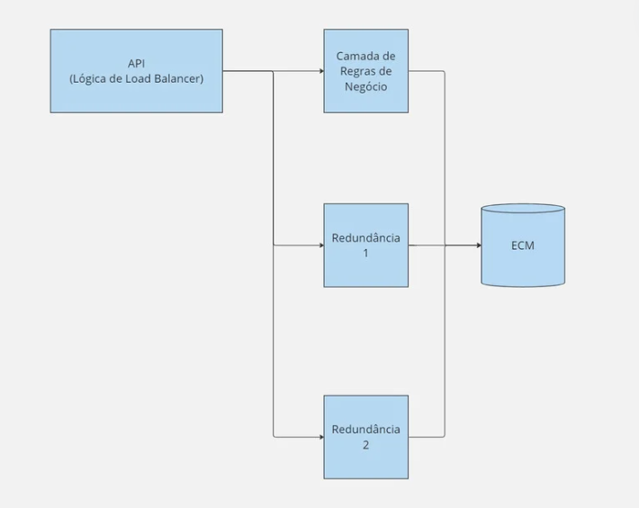

Fonte: desenvolvida pelos autores

A arquitetura do nosso sistema de orquestração de documentos foi estrategicamente aprimorada para alavancar a robustez e a confiabilidade. A nova estrutura é delineada da seguinte maneira:

1. **API (com Lógica de Load Balancer)**: Esta interface continua sendo o ponto de entrada para as requisições, mas agora está aprimorada com uma lógica de load balancer integrada. Isso significa que a API não só recebe solicitações, mas também as distribui inteligentemente entre os servidores, garantindo um equilíbrio na carga de trabalho e uma resposta eficiente.

2. **Camada de Regras de Negócio**: O cerne da nossa lógica de processamento. Aqui, as solicitações são processadas, as regras de negócios aplicadas e as decisões sobre o fluxo de documentos são tomadas. Essa camada assegura que as operações sejam executadas corretamente e em conformidade com as políticas do banco.

3. **Redundâncias 1 e 2**: Adicionamos dois níveis de redundância, estrategicamente posicionados para garantir que o sistema seja resistente a falhas. Cada redundância é configurada para assumir automaticamente caso a principal falhe, mantendo assim a continuidade do serviço sem interrupções.

4. **ECM (Enterprise Content Management)**: O ECM mantém sua função vital de gerenciar o armazenamento, a recuperação e o gerenciamento de documentos eletrônicos. Com as redundâncias adicionadas, o ECM ganha uma camada extra de segurança e disponibilidade.

Esta arquitetura otimizada foi projetada não só para melhorar a eficiência e a segurança, mas também para maximizar a disponibilidade. Ao utilizar serviços gerenciados na nuvem como o AWS RDS, beneficiamo-nos de características como a escalabilidade automática e a manutenção facilitada. Cada camada de redundância opera com criptografia exclusiva, proporcionando uma segurança aprimorada: mesmo na eventualidade de uma falha de segurança, as demais camadas permanecem protegidas. A arquitetura foi concebida para ser dinâmica e adaptável, pronta para escalar conforme as necessidades do banco crescem e mudam, garantindo assim que possam continuar a oferecer serviços de alta qualidade com confiabilidade ininterrupta.

## Documentação do modelo de simulação

### Introdução

Este documento descreve a interface utilizada para comunicar-se com uma API que encapsula a lógica de negócios para interação com um banco de dados simulando um sistema ECM, hospedado em uma instância RDS. O sistema é implementado em Node.js, utilizando TypeScript, e oferece uma camada de abstração que facilita a manipulação de arquivos e interações com o banco de dados através de endpoints de API definidos.

### Estrutura do Projeto

O projeto é organizado em vários arquivos principais localizados na pasta src, responsáveis pela configuração do servidor, definição de rotas e controle das operações da API.

#### index.ts

- *Descrição*: Arquivo principal que configura e inicia o servidor express. Define a porta de escuta e middleware necessário.
- *Detalhes*:
  - Inicia o servidor na porta 5050.
  - Configura o express para interpretar JSON através de middleware.
  - Importa e utiliza as rotas definidas em api.router.ts.

#### api.router.ts

- *Descrição*: Arquivo responsável por definir as rotas da API, redirecionando as requisições para os controladores apropriados.
- *Rotas*:
  - GET /readFile/:id: Encaminha para a função readFile no api.controller.ts para leitura de arquivos com base no ID.
  - POST /createFile: Utiliza a função createFile no api.controller.ts para permitir a criação de arquivos.

#### api.controller.ts

- *Descrição*: Contém a lógica de controle que responde às rotas definidas, tratando as requisições e respostas.
- *Funções*:
  - readFile(req: Request, res: Response): Realiza requisições para obter arquivos, utilizando axios para interagir com a API externa.
  - createFile(req: Request, res: Response): Gerencia a criação de arquivos e envio de respostas, empregando FormData para lidar com os dados.

### Configuração e Dependências

- **Arquivos .env e .env.example**: Armazenam configurações essenciais como variáveis de ambiente, incluindo URLs de APIs e chaves de acesso.
- *Dependências Principais*:
  - *Express*: Framework de servidor para Node.js que facilita a criação de servidores HTTP.
  - *Axios*: Cliente HTTP baseado em promessas para fazer requisições HTTP.
  - *Multer*: Middleware para o tratamento de multipart/form-data, usado principalmente para uploads de arquivos.
  - *Dotenv*: Módulo que carrega variáveis de ambiente de um arquivo .env para o process.env.

### Uso

Para iniciar o servidor, execute node src/index.ts após configurar as variáveis de ambiente necessárias. Assegure-se de que todas as dependências estejam instaladas executando npm install no diretório raiz do projeto.

## Documentação da API de Gerenciamento de Arquivos

### Visão Geral

Esta API foi projetada para simular uma das camadas consideradas importantes na simulação da arquitetura atual do parceiro. Essa camada é responsável pelo contato com um banco de dados na nuvem, especificamente um banco de dados RDS MySQL, simulando o ECM. Esta API é capaz de gerenciar arquivos de documentos, incluindo armazenamento e recuperação direta. Ela é construída com Node.js e utiliza Sequelize para interagir com o banco de dados MySQL hospedado no Amazon RDS.

### Endpoints da API

Abaixo estão os endpoints disponíveis na API de Gerenciamento de Documentos.

#### Fazer Upload de um Documento

- *URL:* /documents/upload
- *Método:* POST
- *Descrição:* Este endpoint é usado para fazer upload de um novo documento no sistema.
- *Corpo da Requisição:*
  - file - O arquivo do documento a ser carregado (formato multipart/form-data).
- *Respostas:*
  - *201 Created:* O documento foi carregado com sucesso e retorna o ID do documento criado.
  - *400 Bad Request:* Falha ao carregar o documento devido a dados de entrada inválidos.

#### Obter Documento

- *URL:* /documents/:id
- *Método:* GET
- *Descrição:* Retorna o documento especificado renderizado diretamente no navegador ou visualizador de PDF.
- *Parâmetros de URL:*
  - id - ID do documento a ser recuperado.
- *Respostas:*
  - *200 OK:* O documento é enviado ao cliente e renderizado diretamente no navegador ou em um visualizador de PDF compatível.
  - *404 Not Found:* Nenhum documento foi encontrado com o ID fornecido.

### Como Rodar

Siga os passos abaixo para configurar e executar esta API localmente:

#### Configurando a API

1. Entre na pasta CamadaLDN e execute o seguinte comando para baixar as dependências

npm install

2. Após isso configure o arquivo .env baseado no .env.example fornecido, ajustando as variáveis necessárias (DB_HOST, DB_NAME, DB_USER, DB_PASS, PORT).

3. Agora para inicializar a API em modo de desenvolvimento basta rodar o seguinte comando:

npm run dev

Isso iniciará o servidor usando nodemon, facilitando o desenvolvimento ao reiniciar automaticamente a aplicação quando arquivos são modificados.

4. Acesse http://localhost:3000 para ver se o servidor está rodando. Utilize ferramentas como Postman para testar os endpoints da API.

## Testes de Carga com Artillery

### Introdução

Os testes de carga são cruciais para verificar a escalabilidade e a resiliência de aplicações. Utilizamos o Artillery, uma ferramenta robusta e flexível para testes de carga em APIs e serviços web. Aqui detalhamos o processo de realização de testes de carga em nossa API que simula a camada de regras de negócio da arquitetura atual do cliente e interpretamos os resultados obtidos para identificar pontos de melhoria na arquitetura.

### Sobre Artillery

Artillery é uma ferramenta moderna de teste de carga e desempenho que simula tráfego de usuário realista para HTTP, WebSocket e outros. É ideal para identificar como uma aplicação se comporta sob condições de uso intensas.

### Como Executar os Testes de Carga

#### Pré-Requisitos

Antes de iniciar, é necessário instalar o Artillery. Se ainda não estiver instalado, pode ser adicionado globalmente via npm:

npm install -g artillery

#### Execução dos Testes
Para executar os testes de carga, navegue até o diretório do projeto onde o arquivo api-load-test.yml está localizado e execute o seguinte comando:

artillery run api-load-test.yml

Não se esqueça que para que os testes deem certo, o servidor precisa estar rodando e devidamente conectado com o banco de dados.

### Interpretação dos Resultados

A análise dos resultados dos testes de carga fornecidos pelo Artillery nos permite entender como a API de Gerenciamento de Documentos comporta-se sob diferentes níveis de demanda. Aqui está a interpretação dos resultados observados durante as fases iniciais dos testes:

#### Métricas Resumidas para os Períodos Iniciais

Durante os primeiros 30 segundos, observamos um aumento consistente no número de requisições atendidas, acompanhado de uma resposta robusta em termos de tempo e taxa de sucesso das requisições.

#### Métricas para o período até 14:36:10(-0300) (duração: 5.198s)

- *Apdex Satisfied:* 600
- *HTTP 200 Codes:* 600
- *Taxa de Requisição:* 116/sec
- *Tempo de Resposta:*
  - *Mínimo:* 0 ms
  - *Máximo:* 65 ms
  - *Médio:* 1.1 ms
  - *Mediana:* 1 ms
  - *P95:* 2 ms
  - *P99:* 4 ms

#### Métricas para o período até 14:36:20(-0300) (duração: 9.227s)

- *Apdex Satisfied:* 1800
- *HTTP 200 Codes:* 1800
- *Taxa de Requisição:* 221/sec
- *Tempo de Resposta:*
  - *Mínimo:* 0 ms
  - *Máximo:* 10 ms
  - *Médio:* 0.9 ms
  - *Mediana:* 1 ms
  - *P95:* 2 ms
  - *P99:* 3 ms

#### Métricas para o período até 14:36:30(-0300) (duração: 9.275s)

- *Apdex Satisfied:* 2300
- *HTTP 200 Codes:* 2300
- *Taxa de Requisição:* 356/sec
- *Tempo de Resposta:*
  - *Mínimo:* 0 ms
  - *Máximo:* 12 ms
  - *Médio:* 0.8 ms
  - *Mediana:* 1 ms
  - *P95:* 2 ms
  - *P99:* 3 ms

As métricas mostram um desempenho consistente e robusto, com tempos de resposta baixos mesmo sob crescente carga:

 - Taxa de Resposta de Sucesso: A estabilidade na taxa de respostas HTTP 200 sugere que a API lida bem com o aumento da carga, sem falhas evidentes.
 - Tempos de Resposta: O tempo de resposta médio permaneceu abaixo de 1 ms para a maior parte, um indicativo de eficiência. Mesmo sob os percentis mais altos (P95 e P99), os tempos se mantêm bastante baixos.
 - Escalabilidade: A ausência de respostas frustradas (apdex.frustrated = 0) e a alta satisfação (apdex.satisfied) indicam que a infraestrutura atual é adequada para as cargas testadas.
- Monitoramento Contínuo: Analisando os resultados obtidos e a implementação dessa API imaginamos ser uma boa escolha implementar algum sistema de monitoramento contínuo, especialmente focando nos tempos de resposta durante picos de uso para garantir que a performance se mantenha dentro dos parâmetros desejados.

### Justificativa da escolha dos requisitos não funcionais

Os tópicos de foco no nosso projeto serão a Tolerância a Falhas e Segurança com viés de criptografia.
Dado isso, escolhemos dois pontos da Arquitetura atual onde é possível agregar valor com técnicas seguindo os tópicos acima, sendo eles:

1 - Redundância com Load Balancer do servidor da regra de negócio
2 - Criptografia no acesso aos arquivos

Em seguida, será possível entender como essas técnicas irão se aplicar na arquitetura atual e os benefícios disso. Mas, por enquanto, foca-se em entender o porquê a equipe escolhei focar nessas técnicas durante a Sprint 1.

**Redundância:**
Após workshop com o parceiro, entendemos que a arquitetura atual (mesmo que em Alto nível) pode ser representada de forma bem simples, onde teremos uma Interface (ponto de contato externo do sistema, assume-se então que seja uma API), que se comunicará com a camada de regra de negócio (idealizou-se um servidor que contenha as regras de negócio e se conecte ao Banco de Dados / ECM), chamaremos essa camada de servidor principal. Dado essa visão em alto nível da arquitetura atual, podemos analisar 3 possibilidades de falha nesse fluxo: Erro interno da Interface ou Erro de conexão com o servidor principal, Erro interno do servidor principal ou Erro de comunicação com o ECM, Erro interno do ECM.
Em alinhamento com o esperado do projeto, concluiu-se que não faria sentido analisar ou estipular qualquer Erro interno do ECM, dado que não teremos contato direto. Porém, após debate interno, entendeu-se que a técnica de redundância é uma hipótese que pode ser muito eficiente para contemplar os Erros internos do servidor principal e do ECM. Vale ressaltar que o grupo, ciente de que não seria possível entender a implementação do ECM para sugerir redundância, decidiu por apresentar a hipótese apenas no servidor principal.

**Criptografia:**
Pensando em segurança, o fluxo simples facilitou a análise e tomada de decisão sobre onde poderíamos implementar criptografia de forma eficiente sem atrapalhar as interações que o usuário possui. Então idealizou-se a criptografia em dois momentos: Inicialmente, é possível imaginar que a criptografia no acesso aos arquivos pode tornar o sistema mais robusto para ataques que consigam burlar a lógica de autenticação já existente.

### Simulação da Arquitetura Nova
Com base nas simulações realizadas na implementação da arquitetura atual, observou-se um comportamento representado pela cadeia de Markov documentada na seção acima, onde o sistema reage a 35% dos defeitos com falha, ou seja, a cada 3 defeitos, aproximadamente, o sistema apresenta uma falha. Dado esse contexto, o grupo entendeu que a implementação de redundância no servidor principal irá reduzir significativamente o índice de falha. Vale lembrar que a equipe está ciente que o número de 35% é uma estimativa que pouco importa, mas o objetivo é demonstrar a redução proporcional que ocorrerá, ou seja, o parceiro será capaz de estimar a aplicabilidade desta hipótese com os números corretos, permitindo então que seja tomada a decisão sobre o valor agregado da hipótese levantada.

Para simular o comportamento do sistema com a implementação das redundâncias, nos baseamos na cadeia de Markov anterior e replicamos os nós que indicam a utilização do servidor principal, de modo a simular o cenário em que, após uma falha no servidor 1, o servidor 2 seja acionado, impedindo a falha do sistema como um todo. O mesmo raciocínio é implementado do servidor 2 para o servidor 3, resultando na seguinte cadeia:

Figura 2: Cadeia de Markov

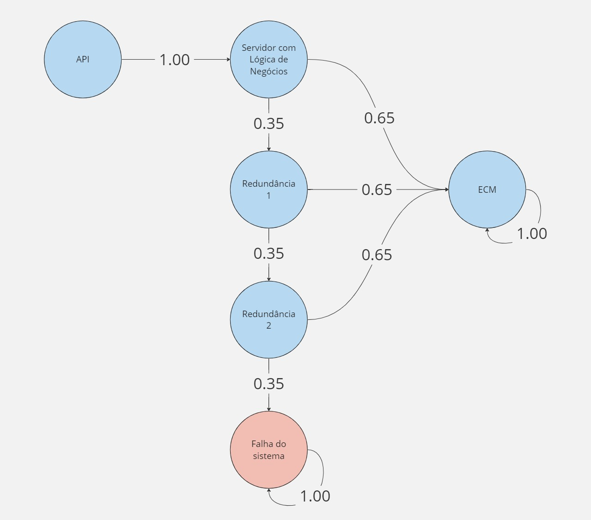

Fonte: desenvolvida pelos autores

Com base na cadeia acima, faremos o cálculo da porcentagem que indica a falha do sistema. No nó do servidor 1, temos que 35% apresentará um erro então, o nosso sistema irá utilizar a sua redundância que apresenta o mesmo comportamento, solucionando 65% do fluxo que chega até ela. Porém, para a porcentagem restante, teremos a redundância 2, novamente com o mesmo comportamento. O que nos permite dizer que para o sistema apresentar uma falha ele deverá corresponder a 35% * 35% *35% = 4.2875% do fluxo total.
Com isso, percebe-se que a ocorrência de falhas no sistema pode ser reduzida drasticamente, de 35% para apenas 4.2875%, apenas pelo fato de que existem 2 redundâncias para o servidor principal.

# Sprint 2

## ATAM 

**Introdução:**
O Architecture Tradeoff Analysis Method (ATAM) é um método para avaliar arquiteturas de software em relação às metas de atributos de qualidade. As avaliações ATAM expõem riscos arquitetônicos que potencialmente inibem o alcance dos objetivos de negócios de uma organização. O ATAM recebe esse nome porque não apenas revela até que ponto uma arquitetura satisfaz objetivos de qualidade específicos, mas também fornece informações sobre como esses objetivos de qualidade interagem entre si – como eles se comparam.

**Motivadores:** 
Chamamos os motivadores do negócio de Business Drivers, no caso do projeto, o sistema ISS (Investment State System) desenvolvido para uso interno o Bank of America tem uma variedade de usos dentro do setor financeiro. Ele facilita a gestão de contas dos clientes, realização de transações financeiras, análise de risco, detecção de fraudes, atendimento ao cliente e gestão de investimentos. Essas funcionalidades ajudam o banco a oferecer serviços eficientes e seguros aos seus clientes, adaptados às demandas do mercado financeiro.

### Identificação das abordagens arquiteturais:
Ao analisar, focamos em 2 RNF (Requisitos Não Funcionais), sendo eles: Tolerância a falhas e Segurança, focando em privacidade, utilizando as táticas: 

Figura 3: ATAM referente ao RNF de segurança

Fonte: desenvolvida pelos autores

Figura 4: ATAM referente ao RNF de tolerância à falhas

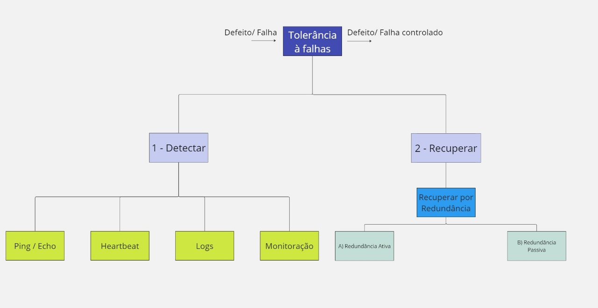

Fonte: desenvolvida pelos autores

#### Mapa de Requisitos não funcionais, com as especificações mensuráveis

# Tolerância à falha

## 1. Detecção de falha
É a capacidade do sistema de identificar problemas ou anomalias em suas operações. No sistema atual do Bank of América não identificamos mecanismos específicos como ping/echo ou heartbeat para detectar falhas, mas a monitoração e os logs estão disponíveis. No sistema novo, serão introduzidos mecanismos como ping/echo e heartbeat para detecção mais rápida de falhas, além da manutenção da monitoração e logs com restrição aumentada para acesso, possivelmente para melhorar a segurança.

|                | Sistema atual               | Sistema novo              |
|----------------|-----------------------------|---------------------------|
| Ping / Echo    | não                         | sim                          |
| Heartbeat      | não                         | sim                       |
| Logs           | sim                         | sim. Com maior restrição para acesso |
| Monitoração    | sim                         | sim                       |

1. **Ping/Echo** :
- Descrição: Ping é um comando usado em redes de computadores para testar a conectividade entre dois dispositivos. Ele envia pacotes de dados para um dispositivo de destino e aguarda uma resposta (echo) para confirmar se o dispositivo está acessível e quanto tempo leva para os pacotes irem e voltarem.
- Aplicação em projetos: O comando Ping é frequentemente utilizado para diagnosticar problemas de conectividade em redes, identificar atrasos (latência) na comunicação entre dispositivos, testar a estabilidade da conexão e verificar a disponibilidade de hosts em uma rede. 

2. **Heartbeat**:
   - Descrição: O Heartbeat é uma técnica ou sistema usado para verificar se um determinado serviço ou recurso está disponível e funcionando corretamente. Geralmente, envolve o envio periódico de mensagens de verificação para confirmar a integridade do sistema.
   - Aplicação em projetos: No contexto de projetos de software ou infraestrutura, o Heartbeat pode ser usado para monitorar a disponibilidade de servidores, aplicativos da web, bancos de dados e outros serviços críticos. Ele pode ser integrado a sistemas de alerta para notificar os administradores caso ocorra uma falha em algum serviço.

3. **Logs**:
   - Descrição: Logs são registros detalhados das atividades e eventos que ocorrem em um sistema de computador. Eles fornecem informações valiosas para diagnosticar problemas, monitorar o desempenho e auditar o sistema.
   - Aplicação em projetos: Logs são essenciais para o desenvolvimento, monitoramento e manutenção de sistemas de software. Eles podem ser usados para rastrear erros, analisar o desempenho, auditar atividades de usuários e garantir a conformidade com regulamentos de segurança e privacidade.

4. **Monitoração**:
   - Descrição: Monitoração, ou monitoramento, é o processo de observar e rastrear o desempenho, a disponibilidade e outros aspectos de sistemas de computador, redes ou aplicativos. O objetivo é identificar problemas, otimizar o desempenho e garantir a disponibilidade contínua dos recursos.
   - Aplicação em projetos: A monitoração é fundamental para garantir a confiabilidade e a eficiência de sistemas de software e infraestrutura. Pode ser usada para monitorar o uso de recursos, identificar gargalos de desempenho, detectar anomalias de segurança e prevenir falhas de sistema. Ferramentas de monitoramento automatizado podem ser integradas a projetos para fornecer insights em tempo real e alertar os administradores sobre problemas potenciais antes que afetem os usuários finais.

## 2. Recuperação por redundância
Envolve a presença de sistemas ou componentes extras que podem entrar em ação se houver falhas nas principais do sistema. No sistema atual do Bank of América não identificamos nenhum método de redundância. No entanto, no sistema novo, foram introduzidos métodos como redundância passiva e ativa para garantir maior disponibilidade e confiabilidade.

|                | Sistema atual               | Sistema novo              |
|----------------|-----------------------------|---------------------------|
| Votação        | não                         | não                       |
| Redundância passiva | não                     | sim                       |
| Redundância ativa | não                       | sim                       |
| Spare / peças  | não                         | não                       |

## 3. Recuperação por substituição

É a capacidade do sistema de substituir componentes ou processos defeituosos por versões íntegras. Tanto no sistema atual quanto no novo, não há métodos específicos de recuperação por substituição como rollback, shadow, rassincronismo ou checkpoint.

|                | Sistema atual               | Sistema novo              |
|----------------|-----------------------------|---------------------------|
| Rollback       | não                         | não                       |
| Shadow         | não                         | não                       |
| Rassincronismo| não                         | não                       |
| Checkpoint     | não                         | não                       |

## 4. Previsão
É a capacidade do sistema de antecipar problemas ou anomalias com base em padrões ou tendências observadas. Nem o sistema atual nem o novo incluem medidas específicas de previsão, como a remoção de serviços ou transações, monitoração avançada ou checkpoints para esse fim.

|                | Sistema atual               | Sistema novo              |
|----------------|-----------------------------|---------------------------|
| Remoção de serviços | não                      | não                       |
| Remoção de transações | não                    | não                       |
| Monitoração    | não                         | não                       |
| Checkpoint     | não                         | não                       |

# Segurança

## Resistir
É a capacidade do sistema de evitar que ameaças causem danos ou comprometam sua integridade. No sistema novo, serão introduzidas medidas como autenticação e autorização de usuários, além de manter os dados confidenciais e íntegros.

|                | Sistema atual               | Sistema novo              |
|----------------|-----------------------------|---------------------------|
| Autenticação usuários | não                   | sim                       |
| Autorizar usuários | não                       | sim                       |
| Dados confidenciais | sim                      | sim                       |
| Dados íntegros | sim                         | sim                       |
| Limitar exposição | não                          | não                         |

1. **Autenticação de Usuários**:
   - Descrição: Autenticação de usuários é o processo de verificar a identidade de um usuário para garantir que ele seja quem diz ser. Isso geralmente é feito por meio de credenciais como nome de usuário e senha, biometria, tokens ou autenticação de dois fatores.
   - Aplicação em projetos: A autenticação de usuários é fundamental em sistemas que lidam com informações sensíveis ou restritas, como sistemas de gerenciamento de contas, aplicativos bancários online, plataformas de comércio eletrônico, entre outros.

2. **Autorização de Usuários**:
   - Descrição: Autorização de usuários é o processo de conceder ou negar acesso a recursos específicos com base nas permissões do usuário autenticado. Isso garante que os usuários tenham acesso apenas às informações e funcionalidades relevantes para suas funções ou necessidades.
   - Aplicação em projetos: A autorização de usuários é essencial em sistemas multiusuários para garantir a segurança e a privacidade dos dados. Pode ser aplicada em sistemas de gerenciamento de conteúdo, aplicativos empresariais e qualquer sistema que exija controle granular de acesso.

3. **Dados Confidenciais**:
   - Descrição: Dados confidenciais são informações sensíveis que requerem proteção especial devido ao seu valor ou natureza sigilosa. Isso pode incluir dados pessoais, financeiros, médicos, segredos comerciais, entre outros.
   - Aplicação em projetos: A proteção de dados confidenciais é uma preocupação crítica em quase todos os projetos que envolvem o armazenamento ou o processamento de informações sensíveis. Isso pode incluir a criptografia de dados, controle de acesso rigoroso e práticas de segurança robustas.

4. **Dados Íntegros**:
   - Descrição: Dados íntegros referem-se à garantia de que os dados permaneçam completos, precisos e intactos ao longo do tempo, sem modificações não autorizadas.
   - Aplicação em projetos: A integridade dos dados é essencial em sistemas onde a precisão e a confiabilidade das informações são críticas, como em bancos de dados, sistemas de gerenciamento de registros médicos e transações financeiras.

## Detectar
É a capacidade do sistema de identificar e responder a ameaças ou atividades suspeitas. No sistema novo, serão introduzidos mecanismos como padrões de acesso, histórico de tráfego e registros/logs para detectar possíveis violações de segurança.

|                | Sistema atual               | Sistema novo              |
|----------------|-----------------------------|---------------------------|
| Padrões de acesso | não                       | sim                       |
| Histórico de tráfego | não                     | sim                       |
| Filtros        | não                         | não                       |
| Registros/logs | não                         | sim                       |
| Endereços e portas | não                        | não                         |

5. **Padrões de Acesso**:
   - Descrição: Padrões de acesso definem as regras e políticas que determinam quem tem permissão para acessar recursos específicos e sob quais condições.
   - Aplicação em projetos: Estabelecer padrões de acesso ajuda a garantir que os sistemas de informação sejam protegidos adequadamente contra acessos não autorizados. Isso pode incluir a implementação de políticas de acesso baseadas em funções, autenticação multifatorial e controle de acesso baseado em contexto.

6. **Histórico de Tráfego**:
   - Descrição: Histórico de tráfego refere-se ao registro de atividades de comunicação que ocorrem em uma rede, como dados transmitidos, origem e destino das comunicações, protocolos utilizados e timestamps associados.
   - Aplicação em projetos: O histórico de tráfego é essencial para monitorar e analisar padrões de uso da rede, detectar anomalias de tráfego, investigar incidentes de segurança e garantir a conformidade com políticas de segurança e privacidade.

7. **Registros/Logs**:
   - Descrição: Registros, também conhecidos como logs, são registros detalhados das atividades e eventos que ocorrem em sistemas de computador, aplicativos ou redes. Eles fornecem uma trilha de auditoria que pode ser usada para rastrear e investigar eventos específicos.
   - Aplicação em projetos: Registros são fundamentais para monitorar o desempenho, diagnosticar problemas, auditar atividades de usuários, detectar ameaças de segurança e garantir a conformidade regulatória. Eles são usados em uma ampla variedade de sistemas, incluindo servidores, aplicativos da web, dispositivos de rede e sistemas operacionais.

## Recuperar
É a capacidade do sistema de se recuperar de ataques ou falhas, restaurando o estado anterior ou mitigando os danos. No sistema novo, serão introduzidas medidas como a capacidade de recuperar o estado por meio de cópias e identificação mais eficiente de ataques.

|                | Sistema atual               | Sistema novo              |
|----------------|-----------------------------|---------------------------|
| Recuperar o estado: Cópias | não                 | sim (em avaliação)                       |
| Identificar o ataque | não                      | sim (em avaliação)                       |
| Identificar o ataque: Trilhas de auditoria | não | não                      |
| Timeline eventos | não                         | não                       |

8. **Recuperar o Estado: Cópias e Recuperação**:
   - Descrição: A recuperação do estado refere-se à capacidade de restaurar um sistema ou conjunto de dados a um estado anterior em caso de falha ou perda de dados. Isso geralmente é alcançado por meio de cópias de segurança (backups) e procedimentos de recuperação.
   - Aplicação em projetos: A implementação de cópias de segurança e procedimentos de recuperação é crítica para garantir a disponibilidade e a resiliência de sistemas de informação. Isso pode envolver a criação regular de backups de dados, a replicação de sistemas em ambientes de failover e a automação de processos de recuperação em caso de falha.

9. **Identificar o Ataque**:
   - Descrição: Identificar o ataque refere-se ao processo de reconhecer e responder a atividades maliciosas ou anômalas que visam comprometer a segurança de sistemas de computador, redes ou dados.
   - Aplicação em projetos: A identificação de ataques é uma parte essencial da segurança da informação e envolve o uso de técnicas como análise de logs, monitoramento de tráfego de rede, detecção de intrusões e análise de comportamento de usuários para identificar e mitigar ameaças de segurança em tempo real.

# **Brainstorm e priorização de cenários:**
Com o objetivo de melhorar a arquitetura até o final das 10 semanas, buscamos fazer um brainstorming com a maior quantidade de cenários onde pode ocorrer defeitos e buscar uma forma para resolvê-los, resultando nos possíveis cenários: 
1. Defeito interno do servidor1 
2. Defeito interno do servidor2
3. Defeito de acesso ao ECM 
4. Defeito interno do servidos LDN 
  4.1. Validação do body/Params 
  4.2. Timeout
  4.3. Arquivo defeituoso

## **Análise das abordagens:**

Cenário de Segurança  (com Criptografia Diferenciada)

1. **Fonte do Estímulo:** Hacker externo.

2. **Estímulo:** Tentativa de violação de dados por meio da API, com o objetivo de acessar o banco de dados. Buscando acessar por uma credencial autorizada. (Fraude) 

3. Ambiente: Operação em ambiente normal, com tráfego moderado.

4. **Artefato:** Banco de dados primário na camada ECM (Enterprise Content Management).

5. **Resposta:** A tentativa de violação é detectada pelo sistema de segurança integrado à API. A camada ECM isola imediatamente o banco de dados comprometido e redireciona as operações para uma instância de backup. Devido às criptografias distintas entre os servidores primário e secundário, os dados no servidor de backup permanecem inacessíveis ao invasor. Ao mesmo tempo, um alerta é enviado para a equipe de segurança, a origem do ataque é registrada, e o acesso do invasor é bloqueado.

6. **Medida de Resposta:** O banco de dados comprometido deve ser isolado em até 20 segundos, enquanto o redirecionamento para a instância de backup deve ocorrer em até 50 segundos. A equipe de segurança deve ser notificada em até 60 segundos. A continuidade do serviço deve ser mantida sem interrupções perceptíveis para os usuários finais.

Cenário de Tolerância a Falhas

1. **Fonte do Estímulo:** Falha de hardware no servidor principal da camada de regras de negócios.

2. **Estímulo:** O servidor principal falha, interrompendo a execução das regras de negócio.

3. **Ambiente:** Ambiente de tráfego normal, sem sobrecarga.

4. **Artefato:** Camada de Regras de Negócio.

5. **Resposta:** As redundâncias 1 e 2 detectam a falha e automaticamente redirecionam as operações para o servidor secundário, mantendo as transações consistentes e assegurando que o processo de orquestração de documentos continue normalmente.

6. **Medida de Resposta:** A mudança para o servidor secundário deve ser concluída em até 30 segundos, sem perda ou ruptura de dados. A continuidade do serviço deve ser mantida sem interrupções perceptíveis para os usuários finais.

## Apresentação de resultados
Após a simulação de mais de 100 requisições, é possível observar o comportamento da Arquitetura nos seguintes gráficos:

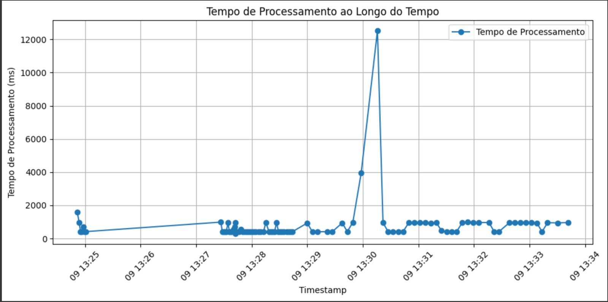
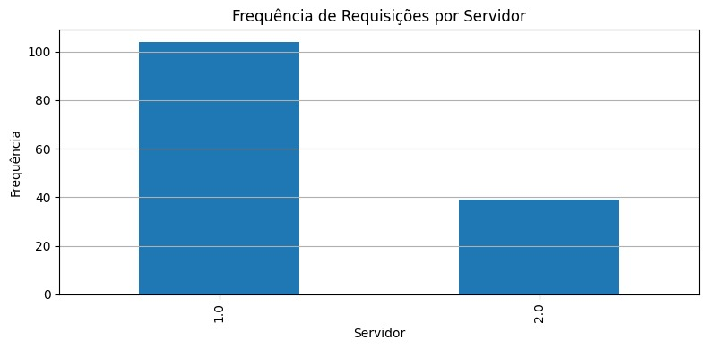

Podemos perceber que houve uma frequência próxima de 35% em que as requisições foram redirecionadas para o servidor 2, comportamento esperado pelos mocks implementados, já explicados na Sprint anterior. 

No primeiro gráfico, podemos perceber pela distribuição dos pontos de que os testes realizados seguiram os seguintes cenários:
* 1 requisição por segundo, durante 10 segundos
* 5 requisições simultâneas
* 1 requisição a cada 1.5 segundos, durante 60 segundos
* Uma requisição a cada 5 segundos, durante 300 segundos

Podemos perceber que o comportamento foi homogêneo na imensa maioria das requisições, havendo apenas 2 amostras que se destacaram com um tempo de processamento maior. Vale citar que não houve nenhuma interferência externa e o sistema foi capaz de retornar ao seu tempo de processamento normal nas requisições seguintes.

# Implementações da Sprint 2

Seguindo com a Entrega da Sprint 1. Inicialmente desenvolvemos a lógica de redundância no servidor principal (CamadaLDN), para fins de validações, realizamos as simulações localmente, onde iniciou-se o servidor principal duas vezes, nas portas 3029 e 3030. Além disso, implementou-se uma lógica na Interface onde após a requisição para o servidor 1 (respectivo à porta 3029), em caso de falha, o sistema é capaz de identificar o erro e fazer uma nova requisição para o servidor 2 (respectivo à porta 3030).

Após a implementação da Arquitetura atual, partimos para a análise ATAM e percebemos que há a necessidade de gerar logs para podermos analisar o comportamento da arquitetura de forma mais precisa. Em acordo com a fala do parceiro no último encontro, partimos para a implementação de geração de logs para cada evento importante do sistema, sendo eles: 
* Chegada de uma nova Requisição
* Defeito do Servidor (em caso de erro, seja no servidor 1 ou 2)
* Tempo de processamento (em caso de sucesso, seja no servidor 1 ou 2)

Todos esses logs estão sendo gerados através de processos assíncronos em um arquivo local logs.json. O objetivo da implementação em ambiente local é facilitar e agilizar a validação da nossa hipótese e a análise dos resultados obtidos.

Foi implementado um google colab que é capaz de receber o arquivo logs.json e ele o converte em um arquivo .xlsx para análise de dados mais completa, o que nos permitiu gerar os resultados visuais apresentados na seção anterior.

Vale ressaltar que, a ideia de centralizar o fluxo de todos os building blocks em uma interface é implementada ao criarmos uma Interface que realiza todas as operações no ECM. O objetivo e os benefícios da implementação foram descritos acima.

Vale lembrar também que o grupo segue uma abordagem incremental, então, a base para a implementação já foi documentada na Sprint anterior.

### Camada de Controle 

Adicionamos uma camada de controle específica à arquitetura do sistema como uma decisão estratégica tomada após a implementação inicial de logs para melhor monitoramento do sistema. A análise desses logs revelou a necessidade de uma camada adicional que não apenas facilitasse a monitoração, mas também otimizasse a gestão dessa funcionalidade. 

Figura 5: Camada de controle adicionada à arquitetura

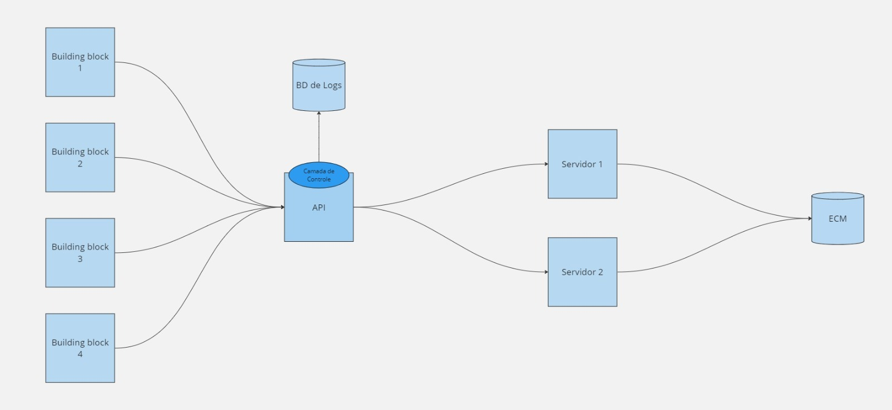

Fonte: desenvolvida pelos autores

1. **Identificação de Necessidades de Monitoramento**: Durante as operações iniciais do sistema, percebeu-se que, apesar da funcionalidade básica de logging estar presente, havia uma lacuna significativa no que se refere à eficiência e à capacidade de manipular e analisar esses logs de maneira proativa. A monitoração eficaz é crítica em ambientes financeiros como o do Bank of America, onde a segurança, a performance e a conformidade regulatória são prioritárias.

2. **Avaliação de Logs**: Os logs gerados durante a operação inicial do sistema revelaram várias oportunidades de melhoria, como a detecção precoce de falhas, a otimização do desempenho do sistema e a prevenção de incidentes de segurança. No entanto, a falta de ferramentas adequadas para analisar esses logs de maneira eficiente levou à necessidade de uma camada dedicada que pudesse centralizar e simplificar essas tarefas.

3. **Proposta da Camada de Controle**: A camada de controle adicionada à arquitetura visa centralizar a funcionalidade de monitoramento, proporcionando ferramentas e serviços especializados para a análise de logs. Esta camada permite a implementação de algoritmos avançados de análise de dados e integração com sistemas de alerta e automação, que podem identificar padrões anormais, sugerir ações corretivas e até automatizar respostas a eventos específicos.

4. **Benefícios da Camada de Controle**:
   - **Melhoria na Detecção de Problemas**: Com ferramentas avançadas de análise de logs, é possível detectar rapidamente problemas que poderiam afetar a estabilidade e a segurança do sistema.
   - **Resposta Automatizada**: A camada de controle pode automatizar respostas a eventos detectados, como falhas de sistema ou tentativas de violação de segurança, melhorando a resiliência do sistema.
   - **Otimização de Recursos**: A centralização da monitoração reduz a carga sobre outras partes do sistema, permitindo uma distribuição mais eficiente de recursos e melhorando o desempenho geral.
   - **Conformidade Regulatória**: Facilita a conformidade com normas e regulamentos financeiros ao garantir que todas as ações no sistema sejam rastreadas e documentadas de forma adequada.

5. **Implementação**: A implementação desta camada envolveu a integração com a infraestrutura existente e o desenvolvimento de novas funcionalidades que são essenciais para a gestão e análise de logs. Também foram consideradas as melhores práticas de segurança para garantir que a camada de controle não introduzisse novas vulnerabilidades.

Essa adição não só resolveu os problemas identificados mas também proporcionou uma plataforma robusta para a melhoria contínua da gestão de sistemas no Bank of America, garantindo uma operação mais segura e eficiente.

# Sprint 3

## Cenários de Testes Aplicados

### Cenário 1: Fluxo ideal

**Descrição:**
O sistema recebe a requisição, consegue realizar a consulta sem problemas e retornar uma resposta para o usuário.

**Pré-condição:**
- O servidor está em operação normal.
- Usuários estão tentando acessar ou utilizar os serviços oferecidos pelo servidor.

**Ação:**
- A interface processa a requisição e redireciona para o servidor principal.
- O servidor principal processa a requisição e retorna a resposta esperada.

**Pós-condição:**
- O usuário obtém sua resposta corretamente.
- O sistema está operante para novas requisições.

**Parâmetros de Entrada:**
- Um arquivo para ser inserido no ECM ou um id para permitir a leitura de um arquivo.

**Parâmetros de Saída:**
- Mensagem de conclusão para o usuário ou um arquivo para leitura.
- Registro do erro nos logs do servidor.

**Critérios de Aceitação:**
1. O sistema deve responder o usuário em tempo hábil (4 a 10 segundos).
2. O sistema deve apresentar um índice de sucesso de 95%

### Cenário 2: Defeito no Acesso ao ECM (Enterprise Content Management)

**Descrição:**
Há uma falha no acesso ao sistema ECM, impedindo o processamento da requisição.

**Pré-condição:**
- O ECM está em operação normal e acessível.
- O sistema ou usuários estão tentando acessar documentos ou conteúdos armazenados no ECM.

**Ação:**
- O sistema detecta o defeito ao tentar acessar o ECM.
- O sistema redireciona a requisição para o servidor redundante.

**Pós-condição:**
- O sistema registra o erro.
- O servidor redundante é capaz de processar a requisição.

**Parâmetros de Entrada:**
- Um arquivo para ser inserido no ECM ou um id para permitir a leitura de um arquivo.

**Parâmetros de Saída:**
- Mensagem de conclusão para o usuário ou um arquivo para leitura.
- Registro do erro nos logs do servidor.

**Critérios de Aceitação:**
1. O defeito de acesso ao ECM deve ser detectado e registrado imediatamente.

### Cenário 3: Defeito de Timeout

**Descrição:**
Há um defeito de timeout no sistema, que impede a requisição de ser processada no servidor principal.

**Pré-condição:**
- O servidor está operacional e acessível.

**Ação:**
- O sistema detecta o defeito de timeout.
- O sistema redireciona a requisição para o servidor redundante.

**Pós-condição:**
- O sistema registra o erro.
- O servidor redundante é capaz de processar a requisição.

**Parâmetros de Entrada:**
- Um arquivo para ser inserido no ECM ou um id para permitir a leitura de um arquivo.

**Parâmetros de Saída:**
- Mensagem de conclusão para o usuário ou um arquivo para leitura.
- Registro do erro nos logs do servidor.

**Critérios de Aceitação:**
1. O defeito de conexão deve ser detectada e registrada corretamente.

### Cenário 4: Defeito de Hardware

**Descrição:**
Um defeito de Hardware ocorre, em qualquer etapa que seja.

**Pré-condição:**
- O servidor LDN está operando normalmente.

**Ação:**
- O sistema detecta o defeito de timeout.
- O sistema redireciona a requisição para o servidor redundante.

**Pós-condição:**
- O sistema registra o erro.
- O servidor redundante é capaz de processar a requisição.

**Parâmetros de Entrada:**
- Um arquivo para ser inserido no ECM ou um id para permitir a leitura de um arquivo.

**Parâmetros de Saída:**
- Mensagem de conclusão para o usuário ou um arquivo para leitura.
- Registro do erro nos logs do servidor.

**Critérios de Aceitação:**
1. O defeito de hardware deve ser detectada e registrada corretamente.

### Resultados 

Dados esses possíveis cenários, vale citar que cada um dos defeitos pode ocorrer novamente no servidor redundante, caindo então na Falha do sistema.
Para testar esses cenários no sistema, realizamos, através do artillery, 3 casos de teste de carga para analisar a reação do sistema.

Caso 1: 7 requisições por segundo durante 10 segundos
Caso 2: 5 requisições por segundo durante 120 segundos
Caso 3: 2 requisições por segundo durante 180 segundos

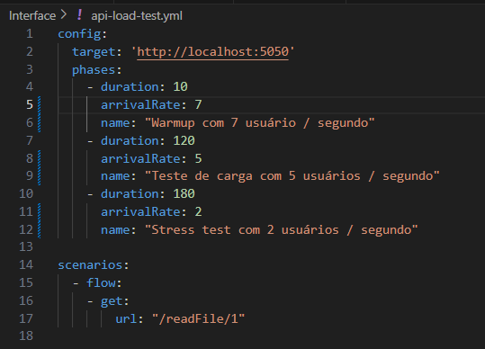

Com esse teste, pudemos analisar os logs gerados e obtemos os seguintes gráficos:

## Registros de Testes Automatizados

Nesta seção, está detalhado os resultados obtidos a partir dos testes automatizados, incluindo informações sobre sucessos e falhas. Os cinco gráficos apresentados fornecem uma visão abrangente sobre o desempenho e a frequência de requisições em servidores ao longo do tempo. Vamos analisar cada gráfico individualmente e tirar algumas conclusões:

### Gráfico 1: Tempo de Processamento ao Longo do Tempo
Este gráfico mostra o tempo de processamento das requisições ao longo do tempo.

- **Eixo X (Timestamp)**: Representa a linha do tempo dos registros.
- **Eixo Y (Tempo de Processamento em ms)**: Mostra o tempo de processamento em milissegundos.
- **Observações**: 
  - Há variações significativas no tempo de processamento.
  - Picos frequentes indicam que ocasionalmente há requisições que demoram mais tempo para serem processadas.
  - A maior parte dos tempos de processamento está concentrada entre 4550 ms e 4700 ms, com alguns picos ultrapassando os 4800 ms.

### Conclusões:
- O sistema apresenta uma variabilidade considerável no tempo de processamento, indicando possíveis momentos de sobrecarga ou problemas esporádicos.
- Pode ser necessário investigar os momentos de maior pico para entender as causas subjacentes e aplicar otimizações ou correções.

### Gráfico 2: Frequência de Requisições por Servidor
Este gráfico mostra a quantidade de requisições processadas por dois servidores diferentes.

- **Eixo X (Servidor)**: Representa os servidores (1.0 e 2.0).
- **Eixo Y (Frequência)**: Mostra o número de requisições processadas.
- **Observações**:
  - O Servidor 1.0 processou significativamente mais requisições (aproximadamente 700) em comparação com o Servidor 2.0 (aproximadamente 300).

### Conclusões:
- Existe uma disparidade na distribuição de requisições entre os dois servidores.
- Pode ser necessário balancear a carga entre os servidores para evitar sobrecarga no Servidor 1.0 e melhorar a eficiência do sistema.

### Gráfico 3: Total de Requisições: Sucessos vs. Falhas
Este gráfico compara o número de requisições bem-sucedidas com o número de falhas.

- **Eixo X (Tipo de Requisição)**: Categorias de Sucessos e Falhas.
- **Eixo Y (Quantidade)**: Quantidade de requisições.
- **Observações**:
  - Sucessos: 1414 requisições.
  - Falhas: 312 requisições.

### Conclusões:
- A taxa de sucesso é alta, com 1414 requisições bem-sucedidas contra 312 falhas.
- No entanto, o número de falhas não é desprezível e representa uma oportunidade para melhoria. A taxa de falha (aproximadamente 18%) indica que há espaço para investigar e resolver os motivos das falhas.

### Gráfico 4: Total de Requisições e Falhas por Servidor
Este gráfico mostra a distribuição de sucessos e falhas para cada servidor.

- **Eixo X (Servidor)**: Representa os servidores (1.0 e 2.0).
- **Eixo Y (Número de Requisições)**: Mostra o número de requisições.
- **Legendas**:
  - Verde: Sucessos.
  - Vermelho: Falhas.
- **Observações**:
  - O Servidor 1.0 processou cerca de 700 requisições, com aproximadamente metade dessas resultando em falhas.
  - O Servidor 2.0 processou menos requisições, cerca de 300, com uma proporção menor de falhas em relação ao servidor 1.0.

### Conclusões:
- O Servidor 1.0 está lidando com uma carga maior de requisições e também apresenta uma taxa de falha mais alta em comparação com o Servidor 2.0.
- A alta taxa de falhas no Servidor 1.0 sugere a necessidade de uma análise detalhada para identificar e corrigir os problemas específicos desse servidor.
- Pode ser benéfico redistribuir parte da carga do Servidor 1.0 para o Servidor 2.0 para balancear melhor as requisições e potencialmente reduzir a taxa de falhas.

### Gráfico 5: Falhas por Servidor
Este gráfico mostra o número de falhas para cada servidor.

- **Eixo X (Servidor)**: Representa os servidores (1.0 e 2.0).
- **Eixo Y (Número de Falhas)**: Mostra o número de falhas.
- **Observações**:
  - O Servidor 1.0 teve mais de 200 falhas.
  - O Servidor 2.0 teve menos de 100 falhas.

### Conclusões:
- O Servidor 1.0 apresenta um número significativamente maior de falhas comparado ao Servidor 2.0.
- A diferença marcante no número de falhas entre os servidores sugere que o Servidor 1.0 pode estar enfrentando problemas de desempenho ou configuração que não afetam o Servidor 2.0.
- Intervenções para melhorar a estabilidade e desempenho do Servidor 1.0 devem ser priorizadas.

### Revisão Minuciosa dos Riscos Inicialmente Identificados

**1. Cenário Ideal de Operação:**
   - **Descrição:** O sistema realiza a consulta e retorna a resposta sem problemas.
   - **Impacto:** O sistema funcionou conforme esperado, processando requisições rapidamente e retornando respostas corretas.
   - **Mitigação:** Manter a configuração atual, realizando monitoramentos contínuos para garantir o desempenho consistente.

**2. Defeito no Acesso ao ECM:**
   - **Descrição:** Falha no acesso ao sistema ECM impede o processamento das requisições.
   - **Impacto:** A falha no ECM redirecionou as requisições para o servidor redundante, que processou corretamente as requisições.
   - **Mitigação:** Melhorar a redundância do ECM e garantir que o servidor redundante esteja sempre atualizado e operacional.

**3. Defeito de Timeout:**
   - **Descrição:** Defeito de timeout no sistema impede o processamento no servidor principal.
   - **Impacto:** As requisições foram redirecionadas para o servidor redundante, garantindo a continuidade do serviço.
   - **Mitigação:** Implementar mecanismos de timeout mais eficientes e otimizar o tempo de resposta do servidor principal.

**4. Defeito de Hardware:**
   - **Descrição:** Falha de hardware em qualquer etapa do processo.
   - **Impacto:** O sistema redirecionou as requisições para o servidor redundante, garantindo a continuidade do serviço.
   - **Mitigação:** Melhorar a manutenção preventiva do hardware e aumentar a redundância de componentes críticos.

### Análise dos Resultados dos Testes

**Teste de Carga:**
   - **Cenário 1:** 7 requisições por segundo durante 10 segundos.
   - **Cenário 2:** 5 requisições por segundo durante 120 segundos.
   - **Cenário 3:** 2 requisições por segundo durante 180 segundos.
   - **Resultados:** O sistema gerou logs que mostraram uma distribuição eficiente das requisições entre os componentes, com a maioria sendo processada pelo servidor principal e pela API ECM.

**Simulações:**
   - **Condições Normais:** A maioria das requisições foi processada pelo servidor principal e pela API ECM, com uma pequena carga no servidor redundante.
   - **Condições de Exceção:** O sistema conseguiu lidar com exceções, demonstrando eficiência da lógica de retry e robustez em cenários anormais.
   - **Condições Limites:** O sistema gerenciou altos volumes de requisições, mostrando que a lógica de retry é eficaz para garantir a entrega das requisições.

## Simulação do Sistema

### Simulação das Melhorias

#### Revisão do Modelo de Simulação em Relação à Implementação
O modelo de simulação foi ajustado para refletir as melhorias implementadas no novo sistema. As alterações consideraram os seguintes pontos:
- A lógica de retry no servidor principal, que permitiu que requisições falhassem e tentassem novamente, impactando o número total de requisições processadas.
- A adição de servidores de redundância e de consulta, otimizando a distribuição das requisições e melhorando a eficiência geral do sistema.

#### Simulação dos Cenários Normais
Durante a simulação dos cenários de uso normais, os gráficos gerados indicaram o seguinte:
- **API_ECM:** Média de 123.3158 requisições.
- **Main_Server:** Média de 1.05E4 requisições, refletindo a lógica de retry, onde uma mesma requisição pode passar duas ou três vezes pelo servidor.
- **Redundancy_Server:** Média de 0.6238 requisições.
- **Consulta_ECM:** Média de 8.7212 requisições.

Os gráficos mostram que as requisições foram distribuídas eficientemente entre os componentes do sistema, com a maioria das requisições sendo processadas pelo Main_Server e pela API_ECM.

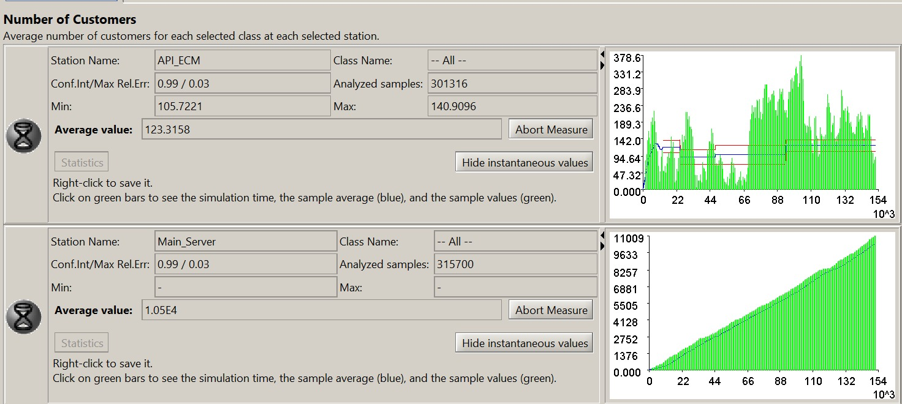
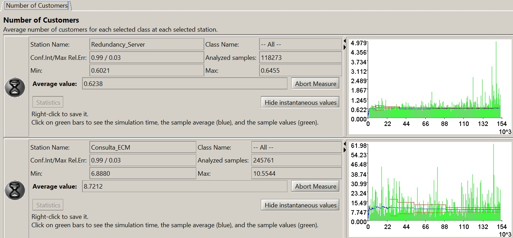

### Simulação das Condições de Exceção

#### Cenários de Exceção
Foram identificados os seguintes cenários de exceção:
- Erros de timeout.
- Erros de hardware.
- Erros de acesso ao ECM.
- Falhas de timeout.
- Falhas de hardware.
- Falhas de acesso ao ECM.

#### Simulação dos Cenários de Exceção
A simulação desses cenários revelou que:
- **Timeout_Error:** 103722 amostras, média de 0.5162 requisições.
- **Hardware_Error:** 30727 amostras, média de 0.1152 requisições.
- **ECM_access_Error:** 11940 amostras, média de 0.0455 requisições.
- **Timeout_Failure:** 5095 amostras, média de 0.0169 requisições.
- **Hardware_Failure:** 1424 amostras, média de 5.01E-3 requisições.
- **ECM_access_Failure:** 710 amostras, média de 2.54E-3 requisições.

Esses valores indicam a capacidade do sistema em lidar com exceções, mostrando a eficiência da lógica de retry e a robustez do sistema em cenários anormais.

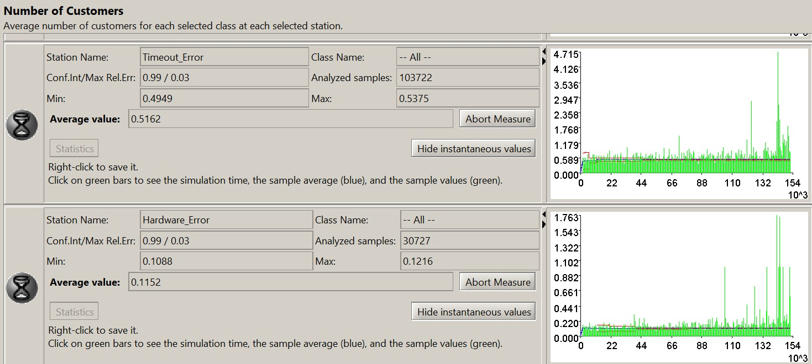
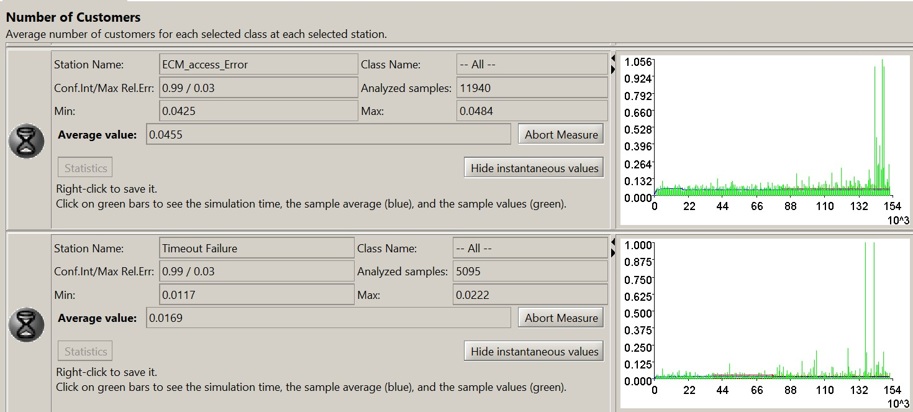
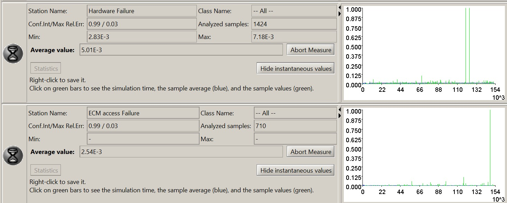

### Simulação das Condições Limites do Sistema com as Melhorias

#### Cenários Limites de Utilização
Foram identificados os seguintes cenários limites de utilização:
- Picos de carga no servidor principal e nos componentes de redundância.
- Condições de carga zero.

#### Simulação dos Cenários Limites
A simulação mostrou que o sistema consegue gerenciar altos volumes de requisições, com os seguintes resultados:
- **Main_Server:** Aproximadamente 315000 requisições.
- **API_ECM e Main_Server combinados:** Quase 600000 requisições devido à lógica de retry.

Os gráficos indicam que o sistema é capaz de processar grandes volumes de requisições e que a lógica de retry funciona eficazmente para garantir a entrega das requisições ou identificar falhas.

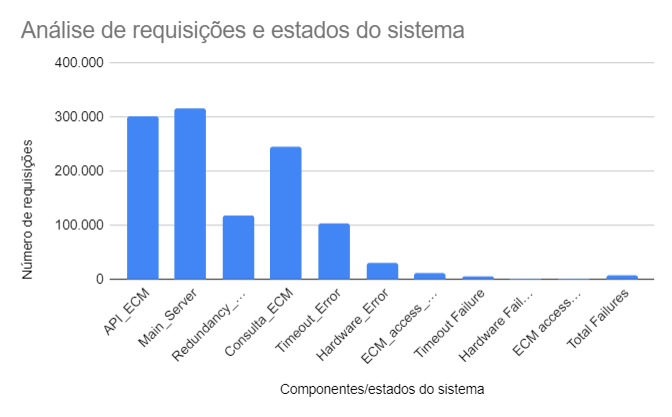

### Comparação com o Sistema Antigo

#### Organização dos Registros de Simulação e Testes
Os registros de simulação foram organizados e analisados, comparando os resultados do novo sistema com os do sistema antigo.

#### Avaliação das Melhorias
Comparado com o sistema atual, o novo sistema apresentou melhorias significativas em termos de:
- Redução de erros e falhas.
- Maior eficiência no processamento de requisições.
- Melhor distribuição de carga entre os componentes.

Os gráficos mostram onde as requisições foram parar, se deram erro e se esse erro foi contornado ou resultou em falha.

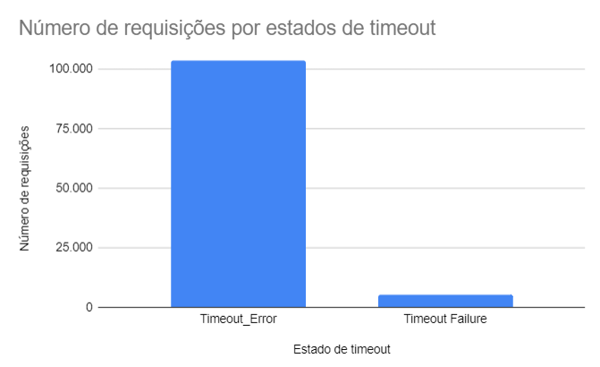
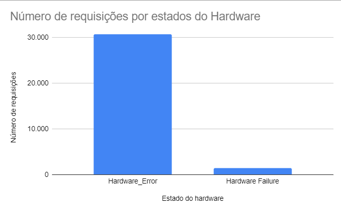
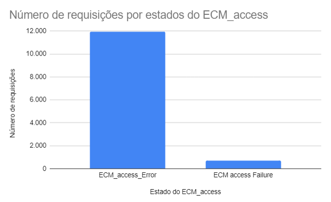

### Propostas de Estratégias de Mitigação

**Redundância e Monitoramento:**
   - **ECM:** Implementar redundância adicional e monitoramento proativo para minimizar falhas.
   - **Servidores:** Melhorar a redundância e realizar manutenções preventivas regularmente para evitar defeitos de hardware.

**Otimização de Tempo de Resposta:**
   - **Timeouts:** Refinar os mecanismos de timeout e realizar testes de carga regulares para garantir tempos de resposta otimizados.
   - **Retry Logic:** Continuar aprimorando a lógica de retry para aumentar a eficiência do processamento de requisições.

**Manutenção e Atualização:**
   - **Hardware:** Realizar manutenções preventivas frequentes e atualizações regulares dos componentes de hardware.
   - **Software:** Atualizar continuamente o software para corrigir bugs e melhorar a performance.

# Sprint 4 

A partir da arquitetura entregue na Sprint 3 e dos resultados dos testes realizados, identificamos várias formas de melhorar o sistema, aumentando sua tolerância à falhas. Nossa proposta de mitigação é a lógica de retry, que visa aumentar a robustez do sistema ao lidar com falhas temporárias.

## Lógica de Retry

A lógica de retry permite que uma requisição seja feita ao servidor e, em caso de erro na primeira tentativa, a operação é repetida até três vezes. Se após a terceira tentativa a falha persistir, a lógica de retry faz com que à camada de controle, redirecione a requisição para um servidor de redundância.

No servidor de redundância, a mesma lógica é aplicada: a requisição é realizada e, em caso de erro na primeira tentativa, a operação é repetida até três vezes. Se a falha persistir após a terceira tentativa, outras medidas de contingência poderão ser acionadas.

Essa abordagem garante que, mesmo diante de falhas temporárias, o sistema tenha várias oportunidades para recuperar-se antes de recorrer a soluções alternativas, aumentando assim a sua resiliência.

Importante ressaltar que a lógica de retry não envolve tomada de decisão; ela simplesmente tenta repetir a operação um número predefinido de vezes em caso de falha. A lógica não avalia o tipo de erro nem tenta adotar estratégias alternativas de resolução. Toda a lógica de decisão, como redirecionamento para o servidor de redundância, é gerenciada pela camada de controle, que é acionada somente após a lógica de retry atingir seu limite de tentativas sem sucesso.

## Testes 

### 1.1. Objetivo dos Testes
O objetivo dos testes desta sprint foi identificar falhas no sistema que pudessem ser melhoradas. Com os resultados obtidos, aprimoramos a arquitetura, tornando-a mais completa e registrando todas as informações que ocorrem nela.

## 2. Sistema Antigo

### 2.1. Tempo de Processamento ao Longo do Tempo

Foi observado que, ao receber muitas requisições simultâneas em um curto período de tempo, o sistema se tornava ineficiente, não registrando todos os logs gerados. Isso é evidente nos intervalos entre 05 17:17 - 05 17:16 e entre 05 17:17 - 05 17:18.

### 2.2. Frequência de Requisições por Servidor

No gráfico, observamos que o servidor 1 recebe uma frequência maior de requisições, o que é esperado, visto que é o servidor principal e recebe as primeiras requisições. Vale ressaltar que nossa arquitetura implementa a lógica de retry; assim, o servidor transfere a requisição para o servidor 2 somente após três falhas consecutivas.

### 2.3. Total de Requisições e Falhas por Servidor

No servidor 1, mais da metade das requisições tiveram sucesso em comparação às que apresentaram erro. As requisições com erro foram transferidas para o servidor 2, que apresentou um número alto de sucesso em relação ao número de falhas.

## 3. Novo Modelo

### 3.1. Tempo de Processamento ao Longo do Tempo

Na nova arquitetura, foi implementada a lógica de armazenar logs utilizando RabbitMQ. Além de ser capaz de lidar com um grande número de requisições, RabbitMQ processa informações como um serviço intermediário. Com isso, a nova arquitetura pode receber um grande número de requisições e armazená-las sem apresentar erros.

### 3.2. Evidência de Melhoria

Analisando o tempo de processamento das arquiteturas antiga e nova, vemos que na arquitetura anterior enviávamos um número menor de requisições e, mesmo assim, a lógica de registro de logs não conseguia registrar todas. Na nova arquitetura, foram testadas 100 vezes mais requisições e não houve nenhum erro de registro.

### 3.3. Frequência de Requisições por Servidor

Conforme esperado, o servidor 1 recebe um número maior de requisições em comparação ao servidor 2, com uma média de mais de 8 mil requisições no servidor 1 e quase 500 requisições no servidor 2.

### 3.4. Total de Requisições e Falhas por Servidor

Neste gráfico, não houve muitas mudanças em comparação ao modelo anterior. Continuamos com um número alto de requisições de sucesso e falha no servidor 1 e um número menor de sucesso e falhas no servidor 2.

## 4. Conclusões
Após realizarmos testes no modelo antigo e analisarmos os resultados, vimos a necessidade de melhorar os registros de logs, que apresentavam erro ao receber muitas requisições em um curto período de tempo, pois não conseguiam processar muitas informações rapidamente. Para solucionar este problema, implementamos o RabbitMQ.

### 4.1. Comparação das Arquiteturas
Na arquitetura anterior, a lógica de armazenamento de logs era mais direta e simples: a Camada de Controle escrevia os logs diretamente no Repositório de Logs. Embora essa abordagem fosse menos complexa e tivesse menos pontos de falha, não era suficiente para lidar com um grande volume de requisições nem oferecia a flexibilidade necessária para sistemas mais complexos.

Na nova arquitetura, a implementação do RabbitMQ permite lidar com um grande número de requisições e processar informações como um serviço intermediário, trazendo várias melhorias. Com a lógica de retry, reduzimos os erros no servidor 1 em aproximadamente 50% em comparação aos testes anteriores.

## Métricas 

Métricas em arquitetura de software são medidas quantitativas usadas para avaliar, monitorar e melhorar a qualidade, desempenho e eficiência de um sistema de software. Elas ajudam a capturar informações objetivas que auxiliam desenvolvedores, arquitetos e gerentes de projeto a tomar decisões informadas sobre o desenvolvimento, manutenção e operação de software. Abaixo vamos detalhar quais métricas foram utilizadas nesse sistema.

### Métricas estáticas 
Métricas estáticas de um sistema são medidas quantitativas que descrevem propriedades do código fonte de um software sem executar o programa. Essas métricas são obtidas através da análise estática do código e fornecem informações sobre a complexidade, qualidade e manutenibilidade do software. 
Com a arquitetura proposta da sprint 3 reforçamos que o Bank of America, como uma das maiores instituições financeiras do mundo, possui uma complexa infraestrutura tecnológica que sustenta suas operações bancárias globais. Os Business Drivers (motores de negócios) do banco são fundamentais para entender as necessidades e demandas da instituição. A plataforma, atualmente utilizada internamente, tem o objetivo de escalar para a América latina e com isso reforçando a necessidade de Segurança e tolerância á falhas. 

### Segurança 

Visando a segurança do sistema, é uma prioridade vital em qualquer organização, especialmente quando se trata da privacidade dos dados. Com o foco de privacidade, utilizando a criptografia que desempenha um papel central nesse contexto. Ela é uma técnica essencial que transforma dados legíveis em um formato codificado, que só pode ser decifrado por aqueles que possuem a chave correta. Essa transformação garante que, mesmo se os dados forem interceptados, eles permanecerão inacessíveis e inúteis para qualquer pessoa não autorizada.
Buscamos entender e propor a criação de diferentes chaves para cada servidor, criptografando o acesso aos arquivos. 

#### Tolerância a falhas 
Para o requisito não funcional de Tolerância a falhas, buscamos entender possíveis problemas, melhorar a qualidade do código e orientar a manutenção e evolução do sistema.

## Inventário de componentes

#### 1. Detectar
   - **Ping / Echo**: Um método de verificar se um host está acessível e ativo através do envio de pacotes de ICMP Echo Request e a recepção de Echo Reply.
   - **Heartbeat**: Um sinal periódico enviado entre sistemas para indicar que o sistema ou componente está funcionando corretamente.
   - **Logs**: Registros que capturam eventos e atividades no sistema, usados para monitorar e detectar falhas.
   - **Monitoração**: Ferramentas e técnicas para observar o desempenho e a saúde do sistema em tempo real.

#### 2. Recuperar
   - **Recuperar por Redundância**: A utilização de componentes redundantes para manter o sistema funcional em caso de falhas.
     - **Redundância Ativa (A)**: Componentes redundantes que estão sempre ativos e prontos para assumir imediatamente em caso de falha.
     - **Redundância Passiva (B)**: Componentes redundantes que são ativados apenas quando ocorre uma falha no componente principal.

### Fluxo do Processo
1. **Defeito/Falha**: Ocorre uma falha ou defeito no sistema.
2. **Tolerância à Falhas**: O sistema entra em modo de tolerância a falhas.
3. **1 - Detectar**: A falha é detectada através dos métodos de ping/echo, heartbeat, logs ou monitoração.
4. **2 - Recuperar**: A falha é controlada e o sistema se recupera utilizando redundância ativa ou passiva.
5. **Defeito/Falha Controlado**: A falha é mitigada e o sistema continua a operar normalmente.

## LOC (Linhas de Código)

Linhas de código que ilustram a função responsável pela captura, registro e armazenamento dos logs gerados pela nossa API.

A partir das métricas estáticas obtemos beneficios em manutenção, simplificamndo a identificação das áreas do código que podem ser difíceis de manter ou que requerem refatoração. 

### Métricas dinâmicas 

Métricas dinâmicas são indicadores coletados e analisados durante a execução de um sistema de software. Elas fornecem informações em tempo real sobre o comportamento do sistema em operação, por isso são cruciais para entender como o sistema se comporta sob diferentes condições de carga, identificar gargalos de desempenho, detectar falhas e garantir a segurança e a eficiência do sistema em produção.

Para nosso foco específico em tolerância a falhas e segurança, as métricas dinâmicas foram selecionadas para garantir que o sistema seja resiliente a falhas e que os dados sejam protegidos de forma adequada. Nesse sentido, essas são as métricas escolhidas para o sistema:

#### Tolerância a Falhas
**Tempo Médio Entre Falhas (Mean Time Between Failures - MTBF)**

- **Descrição:** Tempo médio entre a ocorrência de falhas no sistema.  
- **Importância:** Avalia a confiabilidade do sistema e ajuda a identificar áreas que necessitam de melhorias.
  
**Tempo Médio de Resolução (Mean Time to Resolution - MTTR)**

- **Descrição:** Tempo médio necessário para resolver uma falha ou incidente. 
- **Importância:** Mede a eficiência da equipe de suporte e a rapidez com que o sistema se recupera de falhas.
  
**Taxa de Erro (Error Rate)**

- **Descrição:** Frequência com que erros ocorrem durante a operação do sistema. 
- **Importância:** Importante para monitorar a saúde do sistema e a ocorrência de falhas que podem afetar a continuidade do serviço.
  
**Taxa de Requisições com Timeout (Request Timeout Rate)**

- **Descrição:** Proporção de requisições que atingem o tempo limite em relação ao total de requisições. 
- **Importância:** Identifica problemas de desempenho e disponibilidade que podem indicar falhas no sistema.
  
**Número de Requisições Pendentes (Pending Requests)**

- **Descrição:** Número de requisições que estão aguardando processamento. 
- **Importância:** Ajuda a identificar gargalos e problemas de desempenho que podem levar a falhas.

### Justificativa das Métricas

Essas métricas são essenciais para garantir que o sistema proposto para o Bank of America seja resiliente a falhas e que os dados sejam protegidos de forma eficaz. Monitorar essas métricas permitirá identificar e resolver rapidamente problemas de desempenho e segurança, garantindo a continuidade das operações e a proteção das informações sensíveis.

## Mapeamento de tradeoffs

Para analisarmos os tradeoffs da implementação da lógica de Retry, iremos apresentar os tradeoffs teóricos, indicando quais são os benefícios esperados e os possíveis efeitos negativos no sistema. Desta forma, podemos evidenciar que o principal benefício esperado é o Aumento da Disponibilidade, já que o sistema é capaz de lidar com mais defeitos consecutivos, permitindo que a demanda seja resolvida.

Porém, é necessário levarmos em conta os possíveis negativos dessa implementação, sendo eles:
  
  * **Latência Adicional:** Pelo fato de o sistema exercer o Retry, podemos imaginar que o tempo para solução da demanda pode ser maior que o desejado em alguns casos. Se imaginarmos o caso onde a demanda é resolvida apenas na terceira tentativa do servidor redundante, podemos perceber que o tempo de resposta será a soma das 6 requisições.

  * **Complexidade do Sistema:** Por se tratar de uma lógica a ser adicionada no sistema, devemos nos preocupar com a facilidade de implementação dessa lógica pela equipe de desenvolvedores e o quanto ela afeta a legibilidade do sistema.

  * **Retentativas Desnecessárias:** Devemos também nos preocupar com o fato de que, em falhas que não serão contornadas pelo Retry, é possível que o sistema não tenha uma tomada de decisão complexa para identificá-las, forçando então novas tentativas, que seriam ineficazes.

  * **Falha Silenciosa:** Em um viés semelhante do impacto acima, podemos imaginar a possibilidade de que o retry solucione alguns defeitos que não estão sendo evidenciados pelo mecanismo de Logs, por exemplo.

### Evidências de tradeoffs 

Quanto à Latência Adicional, a previsão se comprovou no sistema, fazendo com que algumas requisições demandassem de 15 - 30 segundos para serem resolvidas, enquanto o tempo médio de cada tentativa se encontrava em 5 segundos. Apesar desse efeito, em conversas com o parceiros, o tempo de resposta não é uma questão tão crítica, questão reforçada pelo acordo de que o Grupo focará em otimizar a Tolerância à Falhas do Sistema.

Para a Complexidade do Sistema, vale ressaltar que a lógica de Retry é muito objetiva, fazendo com que sua aplicação e entendimento sejam majoritariamente fáceis. Como métrica, todos os membros do grupo entenderam e concordaram com a implementação dessa lógica no nosso Sistema. Além disso, no nosso caso, a implementação dessa lógica fez com que nós separássemos a lógica de requisição e tratamento de erros, trazendo ainda maior legibilidade à camada de controle.

Já para as Retentativas Desnecessárias, vale citar que nosso sistema não apresenta tomada de decisão, e isso aumenta a gama de cenários de defeito em que o sistema forçará novas tentativas desnecessariamente. Portanto, destaca-se esse ponto como provável melhoria para a próxima Sprint.

Por fim, para a Falha Silenciosa, ressalta-se que é um efeito difícil de ser mensurado e após análise em conjunto do grupo, os nossos Logs devem ser capazes de retratar qualquer defeito inesperado.
